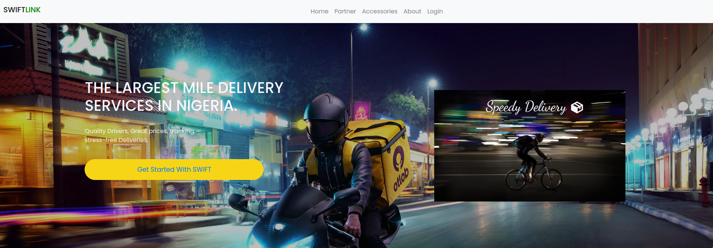

# SwiftLink

SwiftLink is a modern delivery platform designed to provide seamless, efficient, and reliable delivery services. It combines a user-friendly interface with responsive design to ensure an excellent user experience. Built using **HTML**, **CSS (Bootstrap)**, and **JavaScript**, SwiftLink showcases the potential of front-end development in creating an intuitive and scalable delivery website.




You can view the demo [here](https://codemachne.github.io/SwiftLink/).
---

## Table of Contents
- [Project Overview](#project-overview)
- [Features](#features)
- [Technologies Used](#technologies-used)
- [Setup and Usage](#setup-and-usage)
- [Author](#author)
- [Acknowledgments](#acknowledgments)
- [License](#license)

---

## Project Overview

SwiftLink serves as the front-end interface for a delivery company similar to Jumia, offering customers a responsive, aesthetically pleasing, and intuitive platform for placing and tracking orders. It was developed as part of the final project requirements for **ALX Africa** and emphasizes modern web design principles and interactivity using JavaScript.

---

## Features

- **Responsive Design**: Optimized for all devices (desktop, tablet, and mobile) using Bootstrap’s grid system.
- **Interactive UI**: Enhanced with JavaScript for dynamic functionality.
- **Elegant Navigation**: Clean and user-friendly layout for easy browsing.
- **Dynamic Content**: Scalable design to support real-world features such as parcel tracking, service listings, and order management.
- **Cross-Browser Compatibility**: Fully functional across all modern browsers.

---

## Technologies Used

- **HTML5**: For structuring the web pages.
- **CSS3**: For styling and layout design.
- **Bootstrap 5**: For responsive design and pre-styled components.
- **JavaScript**: For adding interactivity and dynamic features.

---

## Setup and Usage

To view and interact with the SwiftLink project locally:

1. Clone the repository:
   ```bash
   git clone https://github.com/CodeMachne/SwiftLink
   ```

2. Navigate to the project directory:
   ```bash
   cd SwiftLink
   ```

3. Open the `index.html` file in your preferred web browser to explore the website.

---

## Author

**Name**: Abang Ayoma  
**School**: ALX Africa  
**Email**: abangfire7@gmail.com  

Feel free to reach out for questions, feedback, or collaboration opportunities!

---

## Acknowledgments

Special thanks to **ALX Africa** for providing the guidance and resources that enabled the completion of this project.

---

## License

This project is licensed under the MIT License. See the `LICENSE` file for more details.
